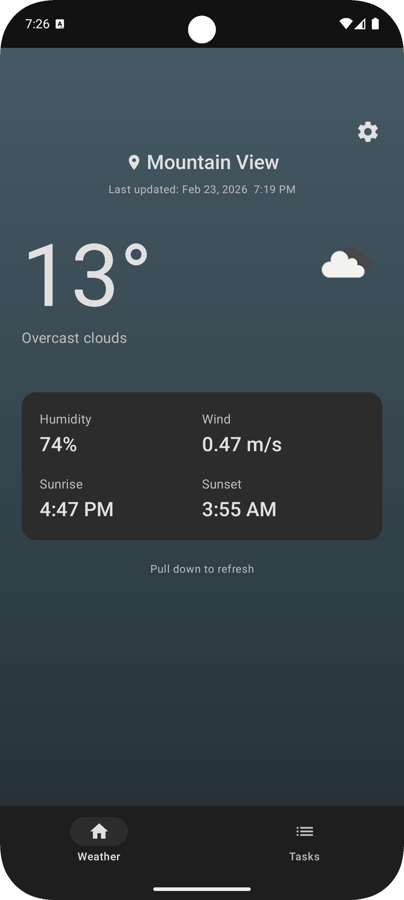
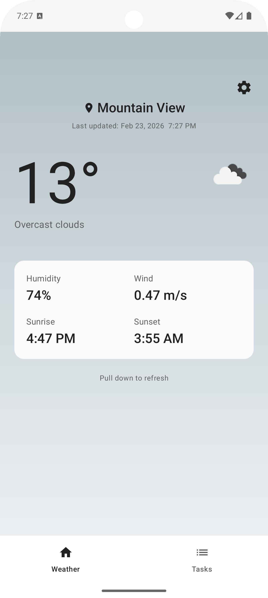
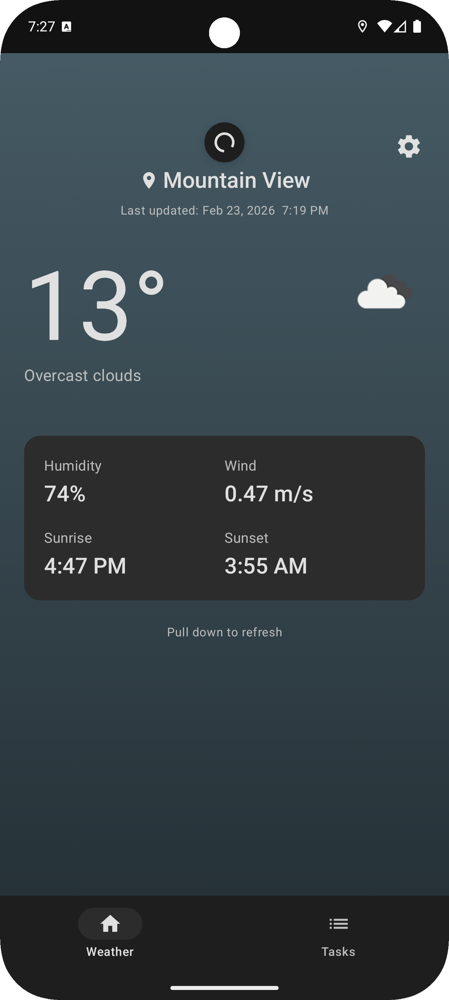
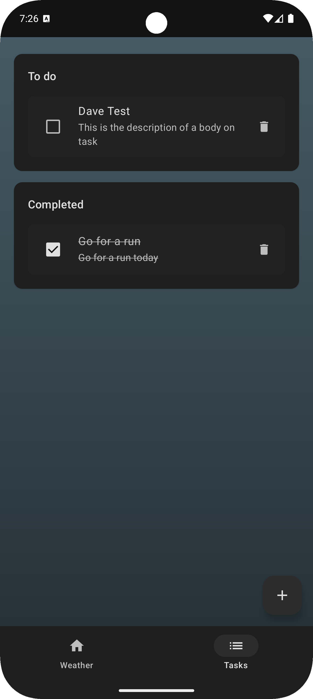
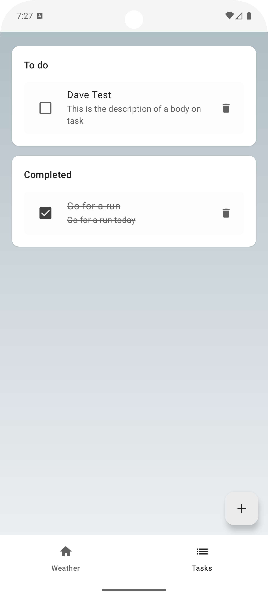
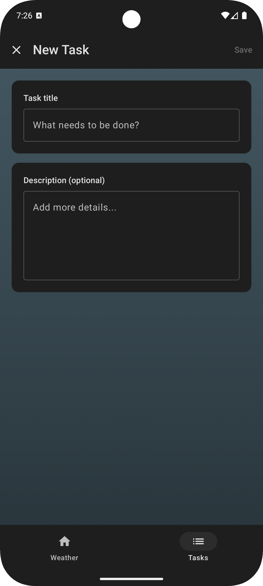

# CoolWeather

A modern Android weather and task management application built with Jetpack Compose and Material Design 3. Features real-time weather updates with dynamic weather-reactive backgrounds and a clean task management system inspired by Google Forms.

## Features

### Weather
- **Real-time Weather Information**: View current weather conditions, temperature, humidity, wind speed, sunrise and sunset times
- **Location-based Weather**: Automatic weather updates based on your device location
- **Pull-to-Refresh**: Quick weather data updates with intuitive pull gesture
- **Google Weather-Inspired Design**: Clean, modern interface with excellent information hierarchy

### Task Management
- **Google Forms-Inspired UI**: Clean card-based layout for better organization
- **Create Tasks**: Add tasks with titles and optional descriptions
- **Manage Tasks**: Mark tasks as complete/incomplete, delete tasks
- **Organized Sections**: Separate "To do" and "Completed" sections
- **Persistent Storage**: All tasks saved locally with Room Database
- **Matching Backgrounds**: Task screen adapts to weather conditions like the weather screen

### Theme System
- **Light and Dark Mode**: Full theme support
- **System Default**: Automatically follows device theme settings
- **Theme Persistence**: Selected theme saved and restored on app restart
- **Professional Monolithic Design**: Clean gray-based color palette

## Screenshots

### Weather Screen

| Dark Mode (Cloudy) | Light Mode (Cloudy) | Weather Refresh |
|-------------------|---------------------|-----------------|
|  |  |  |

**Weather Screen Features:**
- Google Weather-inspired clean design
- Large temperature display with weather icon
- Location name with last update timestamp
- Weather details card (Humidity, Wind, Sunrise, Sunset)
- Pull-to-refresh functionality
- Theme settings button
- Weather-reactive gradient backgrounds

### Task Management

| Tasks Dark Mode | Tasks Light Mode | Add Task Screen |
|-----------------|------------------|-----------------|
|  |  |  |

**Task Screen Features:**
- Google Forms-inspired card-based layout
- Separate sections for "To do" and "Completed" tasks
- Checkbox to mark tasks complete/incomplete
- Task titles with optional descriptions
- Delete button for each task
- Floating action button to add new tasks
- Weather-reactive backgrounds matching weather screen

**Theme Options:**
- Light mode with clean off-white backgrounds
- Dark mode with deep blacks and dark grays
- System default to follow device settings


## Tech Stack

### Core Technologies

- **[Kotlin](https://kotlinlang.org/)** (v2.1.0) - Modern programming language for Android development
- **[Jetpack Compose](https://developer.android.com/jetpack/compose)** - Modern declarative UI toolkit for Android
- **[Material Design 3](https://m3.material.io/)** - Google's latest design system

### Architecture & Libraries

#### Architecture Components
- **[MVVM Pattern](https://developer.android.com/topic/architecture)** - Model-View-ViewModel architecture pattern
- **[Clean Architecture](https://blog.cleancoder.com/uncle-bob/2012/08/13/the-clean-architecture.html)** - Separation of concerns with layers (Domain, Data, Presentation)
- **[Repository Pattern](https://developer.android.com/topic/architecture/data-layer)** - Data layer abstraction
- **[Use Case Pattern](https://developer.android.com/topic/architecture/domain-layer)** - Encapsulated business logic

#### Jetpack Libraries
- **[Lifecycle](https://developer.android.com/topic/libraries/architecture/lifecycle)** (v2.8.7) - Lifecycle-aware components
- **[ViewModel](https://developer.android.com/topic/libraries/architecture/viewmodel)** (v2.8.7) - Store and manage UI-related data
- **[Room Database](https://developer.android.com/training/data-storage/room)** (v2.6.1) - Local database with SQLite abstraction
- **[DataStore](https://developer.android.com/topic/libraries/architecture/datastore)** (v1.0.0) - Modern data storage solution for preferences
- **[KSP](https://github.com/google/ksp)** (v2.1.0-1.0.29) - Kotlin Symbol Processing for code generation

#### Networking
- **[Retrofit](https://square.github.io/retrofit/)** (v2.9.0) - Type-safe HTTP client
- **[OkHttp](https://square.github.io/okhttp/)** (v4.12.0) - HTTP & HTTP/2 client with interceptor support
- **[Gson](https://github.com/google/gson)** (v2.10.1) - JSON serialization/deserialization

#### Asynchronous Programming
- **[Kotlin Coroutines](https://kotlinlang.org/docs/coroutines-overview.html)** (v1.9.0) - Asynchronous programming
- **[Coroutines Android](https://developer.android.com/kotlin/coroutines)** - Android-specific coroutines support
- **[Flow](https://kotlin.github.io/kotlinx.coroutines/kotlinx-coroutines-core/kotlinx.coroutines.flow/-flow/)** - Cold asynchronous data stream

#### Image Loading
- **[Coil](https://coil-kt.github.io/coil/)** (v2.5.0) - Image loading library for Android backed by Kotlin Coroutines

#### Location Services
- **[Google Play Services Location](https://developers.google.com/android/reference/com/google/android/gms/location/package-summary)** (v21.0.1) - Location and geofencing APIs

#### UI Components
- **[Compose Material3](https://developer.android.com/jetpack/androidx/releases/compose-material3)** - Material Design 3 components
- **[Compose Material](https://developer.android.com/jetpack/androidx/releases/compose-material)** (v1.6.0) - Material components including pull-to-refresh

#### Testing
- **[JUnit 4](https://junit.org/junit4/)** (v4.13.2) - Unit testing framework
- **[MockK](https://mockk.io/)** (v1.13.8) - Mocking library for Kotlin
- **[Turbine](https://github.com/cashapp/turbine)** (v1.0.0) - Testing library for Kotlin Flows
- **[Coroutines Test](https://kotlin.github.io/kotlinx.coroutines/kotlinx-coroutines-test/)** (v1.9.0) - Testing utilities for coroutines
- **[Room Testing](https://developer.android.com/training/data-storage/room/testing-db)** (v2.6.1) - Testing utilities for Room Database

### API

- **[OpenWeatherMap API](https://openweathermap.org/api)** - Weather data provider (Current Weather Data API)

## Architecture

#### **MVVM (Model-View-ViewModel)**
Separates UI logic from business logic

**Example from TaskViewModel.kt:**
```kotlin
class TaskViewModel(
    private val getTasksUseCase: GetTasksUseCase,
    private val addTaskUseCase: AddTaskUseCase
) : ViewModel() {
    private val _uiState = MutableStateFlow(TaskUiState())
    val uiState: StateFlow<TaskUiState> = _uiState.asStateFlow()

    fun addTask(title: String, description: String) {
        viewModelScope.launch {
            try {
                addTaskUseCase(title.trim(), description.trim())
            } catch (e: Exception) {
                _uiState.value = _uiState.value.copy(
                    error = "Failed to add task: ${e.message}"
                )
            }
        }
    }
}
```

**Example from TaskScreen.kt:**
```kotlin
@Composable
fun TaskScreen(viewModel: TaskViewModel, ...) {
    val uiState by viewModel.uiState.collectAsState()
   
    if (uiState.todoTasks.isEmpty()) {
        Text("No tasks yet")
    } else {
        uiState.todoTasks.forEachIndexed { index, task ->
            TaskItem(task = task, ...)
        }
    }
}
```

#### **Repository Pattern**
Abstracts data sources from business logic

**Interface (domain/repository/TaskRepository.kt):**
```kotlin
interface TaskRepository {
    fun getTodoTasks(): Flow<List<Task>>
    fun getCompletedTasks(): Flow<List<Task>>
    suspend fun addTask(task: Task): Long
    suspend fun updateTaskCompletion(taskId: Long, isCompleted: Boolean)
    suspend fun deleteTask(taskId: Long)
}
```

**Implementation (data/repository/TaskRepositoryImpl.kt):**
```kotlin
class TaskRepositoryImpl(
    private val taskDao: TaskDao,
    private val taskMapper: TaskMapper
) : TaskRepository {
    override fun getTodoTasks(): Flow<List<Task>> =
        taskDao.getTodoTasks()
            .map { entities -> entities.map { taskMapper.toDomain(it) } }

    override suspend fun addTask(task: Task): Long {
        val entity = taskMapper.toEntity(task)
        return taskDao.insertTask(entity)
    }
}
```

#### **Use Case Pattern**
Encapsulates business logic into reusable components

**Example from GetTasksUseCase.kt:**
```kotlin
class GetTasksUseCase(private val repository: TaskRepository) {
    fun getTodoTasks(): Flow<List<Task>> = repository.getTodoTasks()

    fun getCompletedTasks(): Flow<List<Task>> = repository.getCompletedTasks()
}
```

**Example from AddTaskUseCase.kt:**
```kotlin
class AddTaskUseCase(private val repository: TaskRepository) {
    suspend operator fun invoke(title: String, description: String): Long {
        val task = Task(
            title = title,
            description = description,
            isCompleted = false,
            createdAt = System.currentTimeMillis()
        )
        return repository.addTask(task)
    }
}
```

#### **Factory Pattern**
Creates ViewModel instances with dependencies

**Example from TaskViewModelFactory.kt:**
```kotlin
class TaskViewModelFactory(
    private val context: Context
) : ViewModelProvider.Factory {
    override fun <T : ViewModel> create(modelClass: Class<T>): T {
        val database = WeatherDatabase.getInstance(context)
        val repository = TaskRepositoryImpl(database.taskDao(), TaskMapper())

        val getTasksUseCase = GetTasksUseCase(repository)
        val addTaskUseCase = AddTaskUseCase(repository)
        val toggleTaskCompletionUseCase = ToggleTaskCompletionUseCase(repository)
        val deleteTaskUseCase = DeleteTaskUseCase(repository)

        return TaskViewModel(
            getTasksUseCase,
            addTaskUseCase,
            toggleTaskCompletionUseCase,
            deleteTaskUseCase
        ) as T
    }
}
```

#### **Mapper Pattern**
Converts between data and domain models

**Example from TaskMapper.kt:**
```kotlin
class TaskMapper {
    fun toDomain(entity: TaskEntity): Task {
        return Task(
            id = entity.id,
            title = entity.title,
            description = entity.description,
            isCompleted = entity.isCompleted,
            createdAt = entity.createdAt,
            completedAt = entity.completedAt
        )
    }

    fun toEntity(task: Task): TaskEntity {
        return TaskEntity(
            id = task.id,
            title = task.title,
            description = task.description,
            isCompleted = task.isCompleted,
            createdAt = task.createdAt,
            completedAt = task.completedAt
        )
    }
}
```

#### **Observer Pattern**
UI observes ViewModel state changes via StateFlow

**Example from WeatherViewModel.kt:**
```kotlin
class WeatherViewModel(...) : ViewModel() {
    private val _uiState = MutableStateFlow<WeatherUiState>(WeatherUiState.Initial)
    val uiState: StateFlow<WeatherUiState> = _uiState.asStateFlow()
   
    private fun updateWeatherState(data: WeatherData) {
        _uiState.value = WeatherUiState.Success(data)
    }
}
```

**Example from WeatherScreen.kt:**
```kotlin
@Composable
fun WeatherScreen(viewModel: WeatherViewModel, ...) {
    val uiState by viewModel.uiState.collectAsState()

    when (val state = uiState) {
        is WeatherUiState.Loading -> LoadingView()
        is WeatherUiState.Success -> WeatherContent(state.data)
        is WeatherUiState.Error -> ErrorView(state.message)
    }
}
```

#### **Single Source of Truth**
Room Database as the central data source

**Example from WeatherRepositoryImpl.kt:**
```kotlin
class WeatherRepositoryImpl(...) : WeatherRepository {
    override fun getWeather(): Flow<Result<WeatherData>> = flow {
        
        weatherDao.getWeather().collect { entity ->
            if (entity != null) {
                emit(Result.Success(weatherMapper.toDomain(entity)))
            }
        }
    }

    override suspend fun refreshWeather(lat: Double, lon: Double) {
        try {
            val response = apiService.getCurrentWeather(lat, lon, apiKey)
            val entity = weatherMapper.toEntity(response)
            
            weatherDao.insertWeather(entity)
            
        } catch (e: Exception) {
        }
    }
}
```

## Setup Instructions

### Prerequisites

- Android Studio Hedgehog or later
- Android SDK 24 or higher (Android 7.0+)
- JDK 11 or higher

### Installation

1. **Clone the repository**
   ```bash
   git clone https://github.com/CapSari/CoolWeather.git
   cd CoolWeather
   ```

2. **Build and Run**
   - Open the project in Android Studio
   - Wait for Gradle to sync automatically, or click "Sync Now"
   - Connect an Android device or start an emulator
   - Click the "Run" button in Android Studio (or press `Shift + F10`)
   - Grant location permissions when prompted
   - The app will fetch and display weather for your current location

**Note**: The app includes a default OpenWeatherMap API key for easy testing. For production use or if you encounter API rate limits, you can replace it with your own key:

1. Visit [OpenWeatherMap](https://openweathermap.org/api) and sign up for a free account
2. Navigate to "API keys" section and generate a new API key
3. Add your API key to `local.properties`:
   ```properties
   WEATHER_API_KEY=your_api_key_here
   ```

### Permissions

The app requires the following permissions (requested at runtime):
- `ACCESS_FINE_LOCATION` - For accurate location-based weather
- `ACCESS_COARSE_LOCATION` - For approximate location-based weather
- `INTERNET` - For fetching weather data

## Features Breakdown

### Weather Screen

**Current Weather Display:**
- Temperature with animated weather icon
- Weather description (e.g., "Clear sky", "Light rain")
- Location name with GPS icon
- Last update timestamp

**Weather Details Card:**
- Humidity percentage with icon
- Wind speed in m/s with icon
- Sunrise time
- Sunset time

### Task Screen

- Card-based layout with rounded corners
- Clean, minimal design with proper spacing
- Organized into sections within cards
- Weather-reactive backgrounds matching weather screen

**Task Management:**
- Add tasks with full-screen form
- Task title (required)
- Task description (optional)
- Checkbox to mark complete/incomplete
- Delete button for each task
- Tasks separated into "To do" and "Completed" sections

**Add Task Screen:**
- Full-screen form (not dialog)
- Card-based input fields
- Title field with placeholder
- Multi-line description field
- Save button (top-right, enabled when title is provided)
- Close button (top-left)
- Matching weather-reactive background

**Persistent Storage:**
- All tasks saved to Room Database
- Real-time updates via Flow

### Theme System

**Three Theme Modes:**
- **Light Mode**: Clean with off-white backgrounds
- **Dark Mode**: Deep blacks and dark grays
- **System Default**: Automatically follows device theme

**Theme Features:**
- Persistent theme selection (saved via DataStore)
- Instant theme switching without app restart
- Professional monolithic gray-based color palette
- Weather-reactive backgrounds in all themes
- Material Design 3 color system

**Theme Selection Dialog:**
- Accessible via settings icon on weather screen
- Shows all three options with icons
- Current selection indicated with checkmark
- Smooth transition animations

## Testing

### Running Tests

```bash
# Run all unit tests
./gradlew test

# Run tests for specific variant
./gradlew testDebugUnitTest

# Run with coverage report
./gradlew testDebugUnitTest jacocoTestReport

# Run specific test class
./gradlew test --tests WeatherViewModelTest

# Run tests continuously
./gradlew test --continuous
```

### Test Coverage

#### TaskViewModelTest (17 test cases)
- ✓ Loads todo and completed tasks on initialization
- ✓ Loads empty lists when no tasks exist
- ✓ Adds new tasks successfully

#### WeatherViewModelTest
- ✓ Fetches weather data on initialization
- ✓ Handles location permission granted/denied
- ✓ Updates UI state on successful weather fetch


#### WeatherRepositoryImplTest
- ✓ Fetches and caches weather data
- ✓ Returns cached data from database
- ✓ Updates cache on new data


## Building

### Debug Build
```bash
./gradlew assembleDebug
```
Output: `app/build/outputs/apk/debug/app-debug.apk`

### Release Build
```bash
./gradlew assembleRelease
```
Output: `app/build/outputs/apk/release/app-release.apk`

## Future Enhancements

### High Priority
- [x] 7-day weather forecast with daily cards
- [x] Hourly weather predictions with horizontal scroll
- [x] Weather alerts and warnings

## Troubleshooting

### API Key Issues

**Problem**: "Invalid API key" error
- Ensure you've added the API key to `local.properties`
- Format: `WEATHER_API_KEY=your_actual_key`
- Sync Gradle after adding the key
- Wait 10-15 minutes for new API keys to activate

### Location Issues

**Problem**: Location not found
- Enable location services on your device
- Grant location permissions to the app
- Try running on a physical device (emulators may have GPS issues)
- Check if Google Play Services is installed and updated

### Build Issues

**Problem**: Gradle sync failures
- Use Android Studio Hedgehog or later
- Ensure JDK 11+ is installed and configured
- Clean project: `Build > Clean Project`
- Invalidate caches: `File > Invalidate Caches / Restart`
- Delete `.gradle` and `.idea` folders, then resync

**Problem**: KSP errors
- Ensure KSP version matches Kotlin version
- Clean and rebuild project
- Check that Room and KSP versions are compatible

### Runtime Issues

**Problem**: App crashes on launch
- Check Logcat for error messages
- Ensure all permissions are granted
- Verify API key is correctly configured
- Check if device has internet connection

## Contributing

Contributions are welcome! Please follow these steps:

1. Fork the repository
2. Create a feature branch (`git checkout -b feature/amazing-feature`)
3. Commit your changes (`git commit -m 'Add amazing feature'`)
4. Push to the branch (`git push origin feature/amazing-feature`)
5. Open a Pull Request


## Acknowledgments

- Weather data provided by [OpenWeatherMap](https://openweathermap.org/)
- UI design inspired by Google Weather and Google Forms
- Icons from [Material Design Icons](https://fonts.google.com/icons)
- Built with [Jetpack Compose](https://developer.android.com/jetpack/compose)

